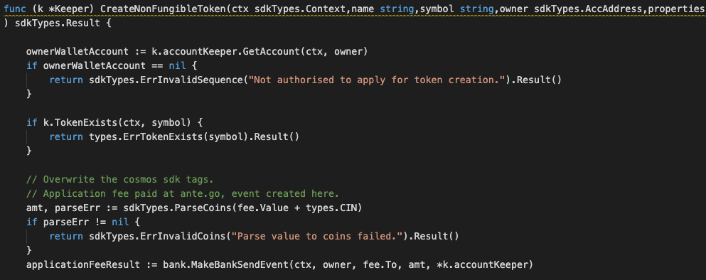
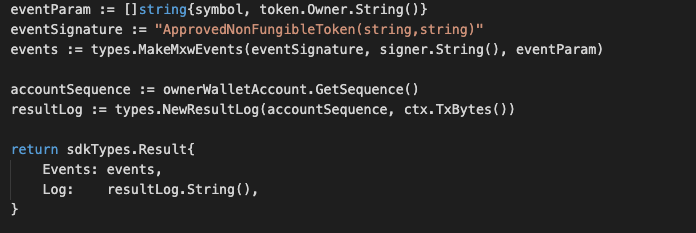
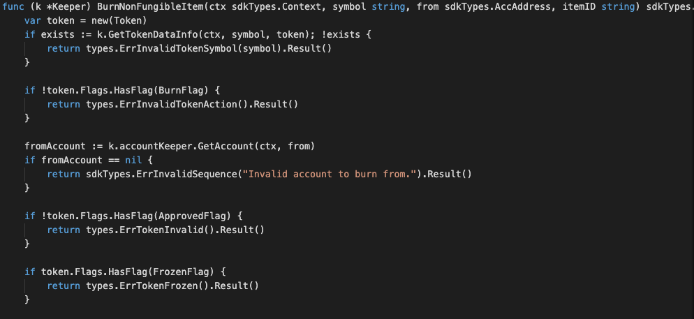
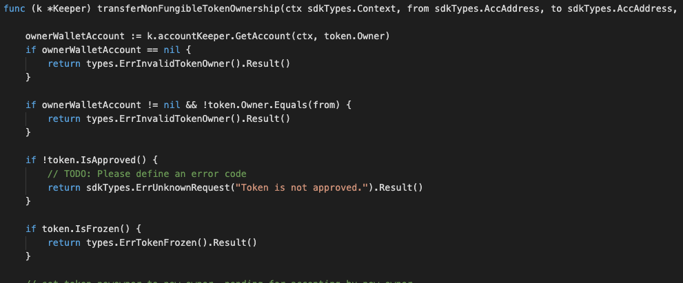
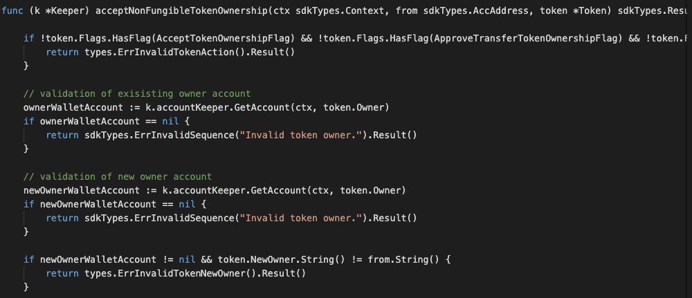
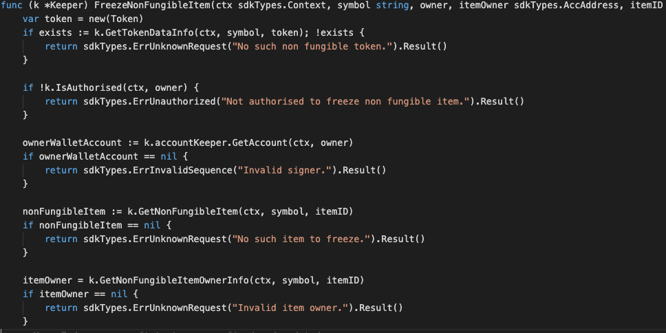
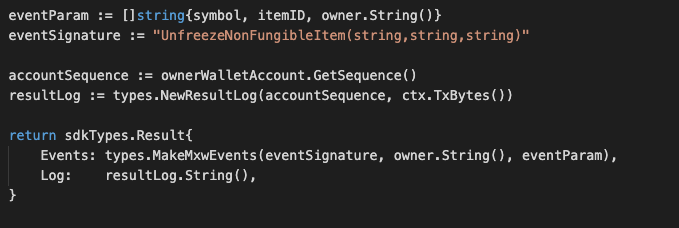
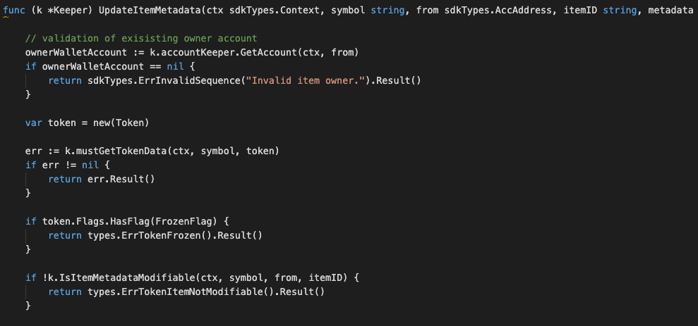
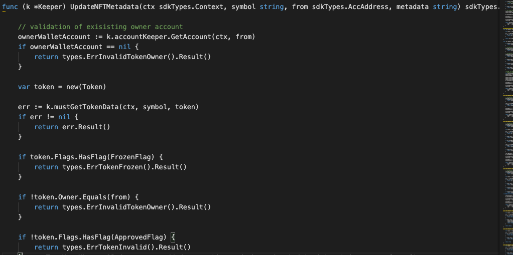
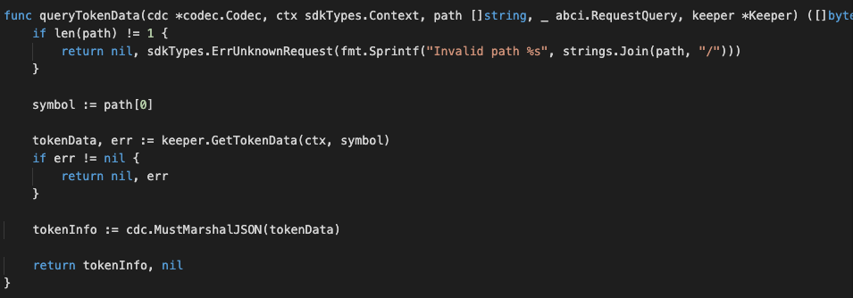

## Application Goals

Non-fungible Tokens are essentially inventory lists, where was CryptoKitties which 
established the first standard called ERC-721. This allowed for an extreme variety of use cases because 
the standard was as un-opinionated as possible as to exactly how the standard was used. 
That’s why we’ve been able to see such a wide range of uses that come from different industries, 
eg. been used in invoices and domain names. That’s why at it’s core a Non-fungible Token only cares about the unique identification number and the token’s place of origin (which makes them essentially inventory lists).

In this section, you will learn how these simple requirements translate to application design.

## Type of Message

In this module which consists of ELEVEN types of messages that users 
can send to interact with the application state: 


## 1. MsgTypeCreateNonFungibleToken
This is the message type used to create a non-fungible token.

#### Parameters

The message type contains the following parameters:

| Name | Type | Required | Description                 |
| ---- | ---- | -------- | --------------------------- |
| name | string | true   | Token name| | 
| symbol | string | true   | Token symbol, which must be unique| | 
| properties | string | true   | Properties of token| | 
| metadata | string | true   | Metadata of token| | 
| owner | string | true   | Token owner| | 
| fee | Fee | true   | Fee information| | 


#### Fee Information
| Name | Type | Required | Description                 |
| ---- | ---- | -------- | --------------------------- |
| to | string | true   | Fee-collector| | 
| value | string | true   | Fee amount to be paid| | 


#### Example
```
{
    "type": "nonFungible/createNonFungibleToken",
    "value": {
        "name": "TestNonFungibleToken",
        "symbol": "TNFT",
        "properties": "token properties",
        "metadata": "token metadata",
        "owner": "mxw1x5cf8y99ntjc8cjm00z603yfqwzxw2mawemf73",
        "fee": {
            "to": "mxw1md4u2zxz2ne5vsf9t4uun7q2k0nc3ly5g22dne",
            "value": "10000000"
        }
    }
}

```

#### Handler

The role of the handler is to define what action(s) needs to be taken when this MsgTypeCreateNonFungibleToken message is received.

In the file (./x/token/nonfungible/handler.go) start with the following code:


NewHandler is essentially a sub-router that directs messages coming into this module to the proper handler.
Now, you need to define the actual logic for handling the MsgTypeCreateNonFungibleToken message in handleMsgCreateNonFungibleToken:




In this function, requirements need to be met before emitted by the network.  

* Token must be unique and not existed.
* Token owner must be authorised.
* A valid Fee will be charged base on this.
* Action of Re-create is not allowed.

#### Events
This tutorial describes how to create maxonrow events for scanner on this after emitted by a network.

  


#### Usage
This MakeMxwEvents create maxonrow events, by accepting :

* Custom Event Signature : using CreatedNonFungibleToken(string,string,string,bignumber)
* Token owner
* Event Parameters as below: 

| Name | Type | Description                 |
| ---- | ---- | --------------------------- |
| symbol | string | Token symbol, which must be unique| | 
| owner | string | Token owner| | 
| to | string | Fee-collector| | 
| value | bignumber | Fee amount to be paid| | 


#### 2. MsgTypeSetNonFungibleTokenStatus
This is the message type used to update the status of a non-fungible token, 
  eg. Approve, Reject, Freeze or unfreeze, Approve-transfer-ownership, Reject-transfer-ownership


#### Parameters

The message type contains the following parameters:

| Name | Type | Required | Description                 |
| ---- | ---- | -------- | --------------------------- |
| owner | string | true   | Item owner| | 
| payload | ItemPayload | true   | Item Payload information| | 
| signatures | []Signature | true   | Array of Signature| | 


#### Item Payload Information
| Name | Type | Required | Description                 |
| ---- | ---- | -------- | --------------------------- |
| token | TokenData | true   | Token data| | 
| pub_key | nil | true   | crypto.PubKey| | 
| signature | []byte | true   | signature| | 


#### Token Data Information
| Name | Type | Required | Description                 |
| ---- | ---- | -------- | --------------------------- |
| from | string | true   | Token owner| | 
| nonce | string | true   | nonce signature| | 
| status | string | true   | status, eg. freeze or unfreeze | | 
| symbol | string | true   | Token-symbol| | 
| transferLimit | string | true   | transfer Limit| | 
| mintLimit | string | true   | mint Limit| | 
| burnable | bool | true   | flag of burnable| | 
| transferable | bool | true   | flag of transferable| | 
| modifiable | bool | true   | flag of modifiable| | 
| pub | bool | true   | flag of public-private| | 
| tokenFees,omitempty | []TokenFee | true   | Fee Setting information| | 
| endorserList | []string | true   | Endorser list| | 


#### Token Fee Information
| Name | Type | Required | Description                 |
| ---- | ---- | -------- | --------------------------- |
| action | string | true   | action | | 
| feeName | string | true   | fee setting| | 


#### Example
```
{
    "type": "nonFungible/setNonFungibleTokenStatus",
    "value": {
        "owner": "mxw1md4u2zxz2ne5vsf9t4uun7q2k0nc3ly5g22dne",
        "payload": {
            "token": {
                "from": "mxw1f8r0k5p7s85kv7jatwvmpartyy2j0s20y0p0yk",
                "nonce": "0",
                "status": "APPROVE",
                "symbol": "TNFT",
                "transferLimit": "2",
                "mintLimit": "2",
                "burnable": true,
                "transferable": true,
                "modifiable": true,
                "pub": true,
                "tokenFees": [
                    {
                        "action": "transfer",
                        "feeName": "default"
                    },
                    {
                        "action": "mint",
                        "feeName": "default"
                    },
                    {
                        "action": "burn",
                        "feeName": "default"
                    },
                    {
                        "action": "transferOwnership",
                        "feeName": "default"
                    },
                    {
                        "action": "acceptOwnership",
                        "feeName": "default"
                    }
                ],
                "endorserList": [
                    "mxw1f8r0k5p7s85kv7jatwvmpartyy2j0s20y0p0yk",
                    "mxw1k9sxz0h3yeh0uzmxet2rmsj7xe5zg54eq7vhla"
                ]
            },
            "pub_key": {
                "type": "tendermint/PubKeySecp256k1",
                "value": "A0VBHXKgUEU2fttqh8Lhqp1G6+GzOxTXvCExzDLEdfD7"
            },
            "signature": "Hiaih1n5Y1/gJQQDKbXmskPPEXzP2MOu+mxRDnJEBXxFtCQeRe3tK5cN7QTl326YpUMvsejG9Go+u4rzNaqILg=="
        },
        "signatures": [
            {
                "pub_key": {
                    "type": "tendermint/PubKeySecp256k1",
                    "value": "Ausyj7Gas2WkCjUpM8UasCcezXrzTMTRbPHqYx44GzLm"
                },
                "signature": "tIRCsR4cy+Kp1IOCOmoBqM8xr/nnnsNGF2V/6QX+UORtx/HNaQ9+HtYkaYGVJ5I4T5yMHXKwtgDU8IpyHD6l/w=="
            }
        ]
    }
}

```

#### Handler

The role of the handler is to define what action(s) needs to be taken when this MsgTypeSetNonFungibleTokenStatus message is received.

In the file (./x/token/nonfungible/handler.go) start with the following code:


NewHandler is essentially a sub-router that directs messages coming into this module to the proper handler.

First, you define the actual logic for handling the MsgTypeSetNonFungibleTokenStatus-ApproveToken message in handleMsgSetNonFungibleTokenStatus:


In this function, requirements need to be met before emitted by the network.  

* A valid Token.
* Token must not be approved.
* Signer must be authorised.
* Action of Re-approved is not allowed.


Second, you define the actual logic for handling the MsgTypeSetNonFungibleTokenStatus-RejectToken message in handleMsgSetNonFungibleTokenStatus:


In this function, requirements need to be met before emitted by the network.  

* A valid Token.
* Token must not be approved.
* Signer must be authorised.
* Action of Re-reject is not allowed.


Thirth, you define the actual logic for handling the MsgTypeSetNonFungibleTokenStatus-FreezeToken message in handleMsgSetNonFungibleTokenStatus:


In this function, requirements need to be met before emitted by the network.  

* A valid Token.
* Token must not be freeze
* Signer must be authorised.
* Action of Re-freeze is not allowed.


Next, you define the actual logic for handling the MsgTypeSetNonFungibleTokenStatus-UnfreezeToken message in handleMsgSetNonFungibleTokenStatus:


In this function, requirements need to be met before emitted by the network.  

* A valid Token.
* Token must be freeze.
* Signer must be authorised.
* Action of Re-unfreeze is not allowed.

Next, you define the actual logic for handling the MsgTypeSetNonFungibleTokenStatus-ApproveTransferTokenOwnership message in handleMsgSetNonFungibleTokenStatus:


In this function, requirements need to be met before emitted by the network.  

* A valid Token.
* Token with TransferTokenOwnership flag equals to true.
* Signer must be authorised.
* Action of Re-approve transfer token-ownership is not allowed.

Last, you define the actual logic for handling the MsgTypeSetNonFungibleTokenStatus-RejectTransferTokenOwnership message in handleMsgSetNonFungibleTokenStatus:


In this function, requirements need to be met before emitted by the network.  

* A valid Token.
* Token TransferTokenOwnershipFlag equals to true.
* Signer must be authorised.
* Action of Re-reject transfer token-ownership is not allowed.


#### Events
#### 1.
This tutorial describes how to create maxonrow events for scanner base on approve token after emitted by a network.

  


#### Usage
This MakeMxwEvents create maxonrow events, by accepting :

* Custom Event Signature : using ApprovedNonFungibleToken(string,string) 
* Token owner
* Event Parameters as below: 

| Name | Type | Description                 |
| ---- | ---- | --------------------------- |
| symbol | string | Token symbol, which must be unique| | 
| owner | string | Token owner| | 


#### 2.
This tutorial describes how to create maxonrow events for scanner base on reject token after emitted by a network.

  

#### Usage
This MakeMxwEvents create maxonrow events, by accepting :

* Custom Event Signature : using RejectedNonFungibleToken(string,string) 
* Token owner
* Event Parameters as below: 

| Name | Type | Description                 |
| ---- | ---- | --------------------------- |
| symbol | string | Token symbol, which must be unique| | 
| owner | string | Token owner| | 


#### 3.
This tutorial describes how to create maxonrow events for scanner base on freeze token after emitted by a network.

  


#### Usage
This MakeMxwEvents create maxonrow events, by accepting :

* Custom Event Signature : using FrozenNonFungibleToken(string,string) 
* Token owner
* Event Parameters as below: 

| Name | Type | Description                 |
| ---- | ---- | --------------------------- |
| symbol | string | Token symbol, which must be unique| | 
| owner | string | Token owner| | 


#### 4.
This tutorial describes how to create maxonrow events for scanner base on unfreeze token after emitted by a network.

  


#### Usage
This MakeMxwEvents create maxonrow events, by accepting :

* Custom Event Signature : using UnfreezeNonFungibleToken(string,string) 
* Token owner
* Event Parameters as below: 

| Name | Type | Description                 |
| ---- | ---- | --------------------------- |
| symbol | string | Token symbol, which must be unique| | 
| owner | string | Token owner| | 


#### 5.
This tutorial describes how to create maxonrow events for scanner base on approve transfer token-ownership after emitted by a network.

  


#### Usage
This MakeMxwEvents create maxonrow events, by accepting :

* Custom Event Signature : using ApprovedTransferNonFungibleTokenOwnership(string,string,string) 
* Token owner
* Event Parameters as below: 

| Name | Type | Description                 |
| ---- | ---- | --------------------------- |
| symbol | string | Token symbol, which must be unique| | 
| owner | string | Token owner| | 
| newOwner | string | New token owner| | 


#### 6.
This tutorial describes how to create maxonrow events for scanner base on reject transfer token-ownership after emitted by a network.

  


#### Usage
This MakeMxwEvents create maxonrow events, by accepting :

* Custom Event Signature : using RejectedTransferNonFungibleTokenOwnership(string,string,string) 
* Token owner
* Event Parameters as below: 

| Name | Type | Description                 |
| ---- | ---- | --------------------------- |
| symbol | string | Token symbol, which must be unique| | 
| owner | string | Token owner| | 
| newOwner | string | New token owner| | 


## 3. MsgTypeTransferNonFungibleItem
This is the message type used to transfer the item of a non-fungible token.


#### Parameters

The message type contains the following parameters:

| Name | Type | Required | Description                 |
| ---- | ---- | -------- | --------------------------- |
| symbol | string | true   | Token symbol, which must be unique| | 
| from | string | true   | Item owner| | 
| to | string | true   | New Item owner| | 
| itemID | string | true   | Properties of token| | 


#### Example
```
{
    "type": "nonFungible/transferNonFungibleItem",
    "value": {
        "symbol": "TNFT",
        "from": "mxw1zrguzs0gyqqscjhk6y8zht9xknfz8e4pnvugy6",
        "to": "mxw1md4u2zxz2ne5vsf9t4uun7q2k0nc3ly5g22dne",
        "itemID": "item-123"
    }
}
```

#### Handler

The role of the handler is to define what action(s) needs to be taken when this MsgTypeTransferNonFungibleItem message is received.

In the file (./x/token/nonfungible/handler.go) start with the following code:


NewHandler is essentially a sub-router that directs messages coming into this module to the proper handler.
Now, you need to define the actual logic for handling the MsgTypeTransferNonFungibleItem message in handleMsgTransferNonFungibleItem:


In this function, requirements need to be met before emitted by the network.  

* A valid Token.
* Token transferable flag equals to true and not in freeze condition.
* Token which Transfer-limit Flag set to a certain threshold, number of items that can be transferrable need to follow this constraint.
* Signer must be a valid item owner.
* Action of Re-transfer is not allowed.


#### Events
This tutorial describes how to create maxonrow events for scanner on this after emitted by a network.

  


#### Usage
This MakeMxwEvents create maxonrow events, by accepting :

* Custom Event Signature : using TransferredNonFungibleItem(string,string,string,string)
* Item owner
* Event Parameters as below: 

| Name | Type | Description                 |
| ---- | ---- | --------------------------- |
| symbol | string | Token symbol, which must be unique| | 
| from | string | Item owner| | 
| to | string | New item owner| | 
| itemID | string | Item ID| | 


## 4. MsgTypeMintNonFungibleItem
This is the message type used to mint an item of a non-fungible token.

#### Parameters

The message type contains the following parameters:

| Name | Type | Required | Description                 |
| ---- | ---- | -------- | --------------------------- |
| itemID | string | true   | Item ID, which must be unique| | 
| symbol | string | true   | Token symbol, which must be unique| | 
| owner | string | true   | Token owner| | 
| to | string | true   | Item owner| | 
| properties | string | true   | Properties of item| | 
| metadata | string | true   | Metadata of item| | 


#### Example
```
{
    "type": "nonFungible/mintNonFungibleItem",
    "value": {
        "itemID": "ITEM-123",
        "symbol": "TNFT",
        "owner": "mxw1x5cf8y99ntjc8cjm00z603yfqwzxw2mawemf73",
        "to": "mxw1md4u2zxz2ne5vsf9t4uun7q2k0nc3ly5g22dne",
        "properties": "item-properties",
        "metadata": "item-metadata"
    }
}

```

#### Handler

The role of the handler is to define what action(s) needs to be taken when this MsgTypeMintNonFungibleItem message is received.

In the file (./x/token/nonfungible/handler.go) start with the following code:


NewHandler is essentially a sub-router that directs messages coming into this module to the proper handler.
Now, you need to define the actual logic for handling the MsgTypeMintNonFungibleItem message in handleMsgMintNonFungibleItem:


In this function, requirements need to be met before emitted by the network.  

* A valid Token.
* Token must be approved, and not yet be freeze.
* Token which Public Flag equals to true can only be minted to same user.
* Token which Mint-limit Flag set to ZERO, any items can be minted without the limitation. Otherwise, will base on the threshold of this setting.
* A valid Item ID which must be unique.
* Action of Re-mint is not allowed.


#### Events
This tutorial describes how to create maxonrow events for scanner on this after emitted by a network.

  


#### Usage
This MakeMxwEvents create maxonrow events, by accepting :

* Custom Event Signature : using MintedNonFungibleItem(string,string,string,string)
* Token owner
* Event Parameters as below: 

| Name | Type | Description                 |
| ---- | ---- | --------------------------- |
| symbol | string | Token symbol, which must be unique| | 
| owner | string | Token owner| | 
| to | string | Item owner| | 
| itemID | string | Item ID| | 


## 5. MsgTypeBurnNonFungibleItem
This is the message type used to burn an item of a non-fungible token.


#### Parameters

The message type contains the following parameters:

| Name | Type | Required | Description                 |
| ---- | ---- | -------- | --------------------------- |
| symbol | string | true   | Token symbol, which must be unique| | 
| from | string | true   | Item owner| | 
| itemID | string | true   | Properties of token| | 


#### Example

```
{
    "type": "nonFungible/burnNonFungibleItem",
    "value": {
        "symbol": "TNFT",
        "from": "mxw1zrguzs0gyqqscjhk6y8zht9xknfz8e4pnvugy6",
        "itemID": "ITEM-123"
    }
}

```

#### Handler

The role of the handler is to define what action(s) needs to be taken when this MsgTypeBurnNonFungibleItem message is received.

In the file (./x/token/nonfungible/handler.go) start with the following code:


NewHandler is essentially a sub-router that directs messages coming into this module to the proper handler.
Now, you need to define the actual logic for handling the MsgTypeBurnNonFungibleItem message in handleMsgBurnNonFungibleItem:




In this function, requirements need to be met before emitted by the network.  

* A valid Token.
* Token must be approved before this, and not be freeze. Also burnable flag must equals to true.
* A valid Item ID.
* Signer who is the Item owner need to be authorised to do this process.
* Action of Re-burn is not allowed.


#### Events
This tutorial describes how to create maxonrow events for scanner on this after emitted by a network.

  


#### Usage
This MakeMxwEvents create maxonrow events, by accepting :

* Custom Event Signature : using BurnedNonFungibleItem(string,string,string)
* Item owner
* Event Parameters as below: 

| Name | Type | Description                 |
| ---- | ---- | --------------------------- |
| symbol | string | Token symbol, which must be unique| | 
| owner | string | Item owner| | 
| itemID | string | Item ID| | 


## 6. MsgTypeTransferNonFungibleTokenOwnership
This is the message type used to transfer-ownership of a non-fungible token.

#### Parameters

The message type contains the following parameters:

| Name | Type | Required | Description                 |
| ---- | ---- | -------- | --------------------------- |
| symbol | string | true   | Token symbol, which must be unique| | 
| from | string | true   | Token owner| | 
| to | string | true   | New token owner| | 


#### Example
```
{
    "type": "nonFungible/transferNonFungibleTokenOwnership",
    "value": {
        "symbol": "TNFT",
        "from": "mxw1x5cf8y99ntjc8cjm00z603yfqwzxw2mawemf73",
        "to": "mxw1zrguzs0gyqqscjhk6y8zht9xknfz8e4pnvugy6"
    }
}

```

#### Handler

The role of the handler is to define what action(s) needs to be taken when this MsgTypeTransferNonFungibleTokenOwnership message is received.

In the file (./x/token/nonfungible/handler.go) start with the following code:


NewHandler is essentially a sub-router that directs messages coming into this module to the proper handler.
Now, you need to define the actual logic for handling the MsgTypeTransferNonFungibleTokenOwnership message in handleMsgTransferNonFungibleTokenOwnership:




In this function, requirements need to be met before emitted by the network.  

* A valid Token.
* Token must be approved, and not yet be freeze.
* Signer must be valid token owner
* Action of Re-transfer-ownership is not allowed.


#### Events
This tutorial describes how to create maxonrow events for scanner on this after emitted by a network.

  


#### Usage
This MakeMxwEvents create maxonrow events, by accepting :

* Custom Event Signature : using TransferredNonFungibleTokenOwnership(string,string,string)
* Token owner
* Event Parameters as below: 

| Name | Type | Description                 |
| ---- | ---- | --------------------------- |
| symbol | string | Token symbol, which must be unique| | 
| owner | string | Token owner| | 
| newOwner | string | New token owner| | 


## 7. MsgTypeAcceptNonFungibleTokenOwnership
This is the message type used to accept-ownership of a non-fungible token.

#### Parameters

The message type contains the following parameters:

| Name | Type | Required | Description                 |
| ---- | ---- | -------- | --------------------------- |
| symbol | string | true   | Token symbol, which must be unique| | 
| from | string | true   | Token owner| | 


#### Example

```
{
    "type": "nonFungible/acceptNonFungibleTokenOwnership",
    "value": {
        "symbol": "TNFT",
        "from": "mxw1zrguzs0gyqqscjhk6y8zht9xknfz8e4pnvugy6"
    }
}
```

#### Handler

The role of the handler is to define what action(s) needs to be taken when this MsgTypeAcceptNonFungibleTokenOwnership message is received.

In the file (./x/token/nonfungible/handler.go) start with the following code:


NewHandler is essentially a sub-router that directs messages coming into this module to the proper handler.
Now, you need to define the actual logic for handling the MsgTypeAcceptNonFungibleTokenOwnership message in handleMsgTypeAcceptNonFungibleTokenOwnership:




In this function, requirements need to be met before emitted by the network.  

* A valid Token.
* A valid Token owner.
* A valid New token owner.
* Token must be approved and not be freeze.
* Action of Re-accept-ownership is not allowed.


#### Events
This tutorial describes how to create maxonrow events for scanner on this after emitted by a network.

  


#### Usage
This MakeMxwEvents create maxonrow events, by accepting :

* Custom Event Signature : using AcceptedNonFungibleTokenOwnership(string,string)
* Token owner
* Event Parameters as below: 

| Name | Type | Description                 |
| ---- | ---- | --------------------------- |
| symbol | string | Token symbol, which must be unique| | 
| from | string | Token owner| | 


## 8. MsgTypeSetNonFungibleItemStatus
This is the message type used to update the status of an item of a non-fungible token, 
  eg. Freeze or unfreeze

#### Parameters

The message type contains the following parameters:

| Name | Type | Required | Description                 |
| ---- | ---- | -------- | --------------------------- |
| owner | string | true   | Item owner| | 
| payload | ItemPayload | true   | Item Payload information| | 
| signatures | []Signature | true   | Array of Signature| | 


#### Item Payload Information
| Name | Type | Required | Description                 |
| ---- | ---- | -------- | --------------------------- |
| item | ItemDetails | true   | Item details information| | 
| pub_key | type/value | true   | crypto.PubKey| | 
| signature | []byte | true   | signature| | 


#### Item Details Information
| Name | Type | Required | Description                 |
| ---- | ---- | -------- | --------------------------- |
| from | string | true   | Item owner| | 
| nonce | string | true   | nonce signature| | 
| status | string | true   | status, eg. freeze or unfreeze | | 
| symbol | string | true   | Token-symbol| | 
| itemID | string | true   | Item ID| | 


#### Example
```
{
  "type": "nonFungible/setNonFungibleItemStatus",
  "value": {
    "owner": "mxw1md4u2zxz2ne5vsf9t4uun7q2k0nc3ly5g22dne",
    "payload": {
      "item": {
        "from": "mxw1f8r0k5p7s85kv7jatwvmpartyy2j0s20y0p0yk",
        "nonce": "0",
        "status": "FREEZE_ITEM",
        "symbol": "TNFT",
        "itemID": "Item-123"
      },
      "pub_key": {
        "type": "tendermint/PubKeySecp256k1",
        "value": "A0VBHXKgUEU2fttqh8Lhqp1G6+GzOxTXvCExzDLEdfD7"
      },
      "signature": "hEnOeX536dduNFgWMOdK0cFKq2xwWW9aAHalW9l5kAgxg94P55MIEQJ8vFkEq9eAcYo1sjQ4TfXW5EynIk/kuQ=="
    },
    "signatures": [
      {
        "pub_key": {
          "type": "tendermint/PubKeySecp256k1",
          "value": "Ausyj7Gas2WkCjUpM8UasCcezXrzTMTRbPHqYx44GzLm"
        },
        "signature": "uDh1fll2eN/3lpKgMydW9mEdgfI3Mint30pkFrrQ+phkIY5X8nMbCoS6WNmw5bqCiVunMhkey75U3Qm99csG4g=="
      }
    ]
  }
}

```

#### Handler

The role of the handler is to define what action(s) needs to be taken when this MsgTypeSetNonFungibleItemStatus message is received.

In the file (./x/token/nonfungible/handler.go) start with the following code:


NewHandler is essentially a sub-router that directs messages coming into this module to the proper handler.
Now, you define the actual logic for handling the MsgTypeSetNonFungibleItemStatus-FreezeNonFungibleItem message in handleMsgSetNonFungibleItemStatus:




In this function, requirements need to be met before emitted by the network.  

* A valid Token.
* A valid Item ID which must not be freeze.
* Signer must be authorised.
* Action of Re-freeze-item is not allowed.

Next, you define the actual logic for handling the MsgTypeSetNonFungibleItemStatus-UnfreezeNonFungibleItem message in handleMsgSetNonFungibleItemStatus:


In this function, requirements need to be met before emitted by the network.  

* A valid Token.
* A valid Item ID which must be freeze.
* Signer must be authorised.
* Action of Re-unfreeze-item is not allowed.


#### Events

#### 1.
This tutorial describes how to create maxonrow events for scanner base on freeze-item after emitted by a network.

  


#### Usage
This MakeMxwEvents create maxonrow events, by accepting :

* Custom Event Signature : using FrozenNonFungibleItem(string,string,string) 
* Signer
* Event Parameters as below: 

| Name | Type | Description                 |
| ---- | ---- | --------------------------- |
| symbol | string | Token symbol, which must be unique| | 
| owner | string | Signer| | 
| itemID | string | Item ID| | 


#### 2.
This tutorial describes how to create maxonrow events for scanner base on unfreeze-item after emitted by a network.

  


#### Usage
This MakeMxwEvents create maxonrow events, by accepting :

* Custom Event Signature : using UnfreezeNonFungibleItem(string,string,string) 
* Signer
* Event Parameters as below: 

| Name | Type | Description                 |
| ---- | ---- | --------------------------- |
| symbol | string | Token symbol, which must be unique| | 
| owner | string | Signer| | 
| itemID | string | Item ID| | 


## 9. MsgTypeEndorsement
This is the message type used to endorse an item of a non-fungible token.

#### Parameters

The message type contains the following parameters:

| Name | Type | Required | Description                 |
| ---- | ---- | -------- | --------------------------- |
| symbol | string | true   | Token symbol, which must be unique| | 
| from | string | true   | Endorser| | 
| itemID | string | true   | Item ID, which must be unique| | 


#### Example
```
{
    "type": "nonFungible/endorsement",
    "value": {
        "symbol": "TNFT",
        "from": "mxw1k9sxz0h3yeh0uzmxet2rmsj7xe5zg54eq7vhla",
        "itemID": "ITEM-123"
    }
}


```

#### Handler

The role of the handler is to define what action(s) needs to be taken when this MsgTypeEndorsement message is received.

In the file (./x/token/nonfungible/handler.go) start with the following code:


NewHandler is essentially a sub-router that directs messages coming into this module to the proper handler.
Now, you need to define the actual logic for handling the MsgTypeEndorsement message in handleMsgEndorsement:


In this function, requirements need to be met before emitted by the network.  

* A valid Item ID.
* Signer must be a valid endorser.
* Action of Re-endorse process is allowed.


#### Events
This tutorial describes how to create maxonrow events for scanner on this after emitted by a network.

  


#### Usage
This MakeMxwEvents create maxonrow events, by accepting :

* Custom Event Signature : using EndorsedNonFungibleItem(string,string,string)
* Endorser
* Event Parameters as below: 

| Name | Type | Description                 |
| ---- | ---- | --------------------------- |
| symbol | string | Token symbol, which must be unique| | 
| owner | string | Endorser| | 
| itemID | string | Item ID| | 


## 10. MsgTypeUpdateItemMetadata
This is the message type used to update item metadata of a non-fungible token.

#### Parameters

The message type contains the following parameters:

| Name | Type | Required | Description                 |
| ---- | ---- | -------- | --------------------------- |
| symbol | string | true   | Token symbol, which must be unique| | 
| from | string | true   | Item owner| | 
| itemID | string | true   | Item ID| | 
| metadata | string | true   | Metadata of item| | 


#### Example
```
{
    "type": "nonFungible/updateItemMetadata",
    "value": {
        "symbol": "TNFT",
        "from": "mxw1md4u2zxz2ne5vsf9t4uun7q2k0nc3ly5g22dne",
        "itemID": "ITEM-123",
        "metadata": "update Item metadata 9991"
    }
}
```

#### Handler

The role of the handler is to define what action(s) needs to be taken when this MsgTypeUpdateItemMetadata message is received.

In the file (./x/token/nonfungible/handler.go) start with the following code:


NewHandler is essentially a sub-router that directs messages coming into this module to the proper handler.
Now, you need to define the actual logic for handling the MsgTypeUpdateItemMetadata message in handleMsgUpdateItemMetadata:




In this function, requirements need to be met before emitted by the network.  

* A valid Token.
* Token not in freeze condition.
* Token which Modifiable Flag is TRUE, Item owner allowed to modify item-metadata.
* Token which Modifiable Flag is FALSE, only Token owner allowed to modify the item-metadata.
* A valid Item ID which not in freeze condition.
* Signer must be valid item owner.
* Action of Re-update is allowed.


#### Events
This tutorial describes how to create maxonrow events for scanner on this after emitted by a network.

  


#### Usage
This MakeMxwEvents create maxonrow events, by accepting :

* Custom Event Signature : using UpdatedNonFungibleItemMetadata(string,string,string)
* Item owner
* Event Parameters as below: 

| Name | Type | Description                 |
| ---- | ---- | --------------------------- |
| symbol | string | Token symbol, which must be unique| | 
| owner | string | Item owner| | 
| itemID | string | Item ID| | 


## 11. MsgTypeUpdateNFTMetadata
This is the message type used to update metadata of a non-fungible token.

#### Parameters

The message type contains the following parameters:

| Name | Type | Required | Description                 |
| ---- | ---- | -------- | --------------------------- |
| symbol | string | true   | Token symbol, which must be unique| | 
| from | string | true   | Token owner| | 
| metadata | string | true   | Metadata of token| | 

#### Example
```
{
    "type": "nonFungible/updateNFTMetadata",
    "value": {
        "symbol": "TNFT",
        "from": "mxw1x5cf8y99ntjc8cjm00z603yfqwzxw2mawemf73",
        "metadata": "token metadata updated here"
    }
}
```

#### Handler

The role of the handler is to define what action(s) needs to be taken when this MsgTypeUpdateNFTMetadata message is received.

In the file (./x/token/nonfungible/handler.go) start with the following code:


NewHandler is essentially a sub-router that directs messages coming into this module to the proper handler.
Now, you need to define the actual logic for handling the MsgTypeUpdateNFTMetadata message in handleMsgUpdateNFTMetadata:




In this function, requirements need to be met before emitted by the network.  

* A valid Token.
* Token must be approved and not in freeze condition.
* Signer must be valid token owner
* Action of Re-update is allowed.


#### Events
This tutorial describes how to create maxonrow events for scanner on this after emitted by a network.

  


#### Usage
This MakeMxwEvents create maxonrow events, by accepting :

* Custom Event Signature : using UpdatedNonFungibleTokenMetadata(string,string)
* Token owner
* Event Parameters as below: 

| Name | Type | Description                 |
| ---- | ---- | --------------------------- |
| symbol | string | Token symbol, which must be unique| | 
| owner | string | Token owner| | 


## Querier

Now you can navigate to the ./x/token/nonfungible/querier.go file. 
This is the place to define which queries against application state users will be able to make. 
 
Here, you will see NewQuerier been defined, and it acts as a sub-router for queries to this module (similar the NewHandler function). Note that because there isn't an interface similar to Msg for queries, we need to manually define switch statement cases (they can't be pulled off of the query .Route() function):


This module will expose few queries:


## A. ListTokenSymbol
This query the item data by given of symbol and item ID.

After the router is defined, define the inputs and responses for this queryItemData:


Notes on the above code:

This query request TWO path-parameters which refer to token-symbol and item-id. 
The output type should be something that is both JSON marshalable and stringable (implements the Golang fmt.Stringer interface). The returned bytes should be the JSON encoding of the output result.

For the output of Item, the normal Item struct is already JSON marshalable, but we need to add a .String() method on it.

#### Parameters
| Name | Type | Default | Required | Description                 |
| ---- | ---- | ------- | -------- | --------------------------- |
| path | string | false | false    | Path to the data (eg. "/a/b/c") |
| data | []byte | false | true     | Data |
| height | int64 | 0 | false    | Height (0 means latest) |
| prove | bool | false | false    | Include proofs of the transactions inclusion in the block, if true |


#### Example
In this example, we will explain how to query item data with abci_query. 

Run the command with the JSON request body:
```
curl 'http://localhost:26657/'
```

```
{
    "method": "abci_query",
    "params": [
    	"/custom/nonFungible/item_data/TNFT-E2/770099",
    	"",
    	"0",
    	false
    	],
    "id": 0,
    "jsonrpc": "2.0"
}

```

The above command returns JSON structured like this: 
```
{
    "jsonrpc": "2.0",
    "id": 0,
    "result": {
        "response": {
            "code": 0,
            "log": "",
            "info": "",
            "index": "0",
            "key": null,
            "value": "eyJJRCI6Ijc3MDA5OSIsIlByb3BlcnRpZXMiOiJwcm9wZXJ0aWVzIiwiTWV0YWRhdGEiOiJtZXRhZGF0YSIsIlRyYW5zZmVyTGltaXQiOiIwIiwiRnJvemVuIjpmYWxzZX0=",
            "proof": null,
            "height": "754",
            "codespace": ""
        }
    }
}
```


## B. TokenData
This query the token data by a given symbol.

After the router is defined, define the inputs and responses for this queryTokenData:




Notes on the above code:

This query request ONE path-parameter which refer to token-symbol. 
The output type should be something that is both JSON marshalable and stringable (implements the Golang fmt.Stringer interface). The returned bytes should be the JSON encoding of the output result.

For the output of Token, the normal Token struct is already JSON marshalable, but we need to add a .String() method on it.


#### Parameters
| Name | Type | Default | Required | Description                 |
| ---- | ---- | ------- | -------- | --------------------------- |
| path | string | false | false    | Path to the data (eg. "/a/b/c") |
| data | []byte | false | true     | Data |
| height | int64 | 0 | false    | Height (0 means latest) |
| prove | bool | false | false    | Include proofs of the transactions inclusion in the block, if true |


#### Example
In this example, we will explain how to query token data with abci_query. 

Run the command with the JSON request body:
```
curl 'http://localhost:26657/'
```

```
{
    "method": "abci_query",
    "params": [
    	"/custom/nonFungible/token_data/TNFT-E2",
    	"",
    	"0",
    	false
    	],
    "id": 0,
    "jsonrpc": "2.0"
}

```

The above command returns JSON structured like this: 
```
{
    "jsonrpc": "2.0",
    "id": 0,
    "result": {
        "response": {
            "code": 0,
            "log": "",
            "info": "",
            "index": "0",
            "key": null,
            "value": "eyJGbGFncyI6MTE1LCJOYW1lIjoiVGVzdE5vbkZ1bmdpYmxlVG9rZW4iLCJTeW1ib2wiOiJUTkZULUUyIiwiT3duZXIiOiJteHcxeDVjZjh5OTludGpjOGNqbTAwejYwM3lmcXd6eHcybWF3ZW1mNzMiLCJOZXdPd25lciI6IiIsIlByb3BlcnRpZXMiOiIiLCJNZXRhZGF0YSI6InRva2VuIG1ldGFkYXRhIiwiVG90YWxTdXBwbHkiOiIxIiwiVHJhbnNmZXJMaW1pdCI6IjIiLCJNaW50TGltaXQiOiIyIiwiRW5kb3JzZXJMaXN0IjpbIm14dzFmOHIwazVwN3M4NWt2N2phdHd2bXBhcnR5eTJqMHMyMHkwcDB5ayIsIm14dzFrOXN4ejBoM3llaDB1em14ZXQycm1zajd4ZTV6ZzU0ZXE3dmhsYSJdfQ==",
            "proof": null,
            "height": "746",
            "codespace": ""
        }
    }
}
```


## C. ItemData
This query the item data by given of symbol and item ID.

After the router is defined, define the inputs and responses for this queryItemData:


Notes on the above code:

This query request TWO path-parameters which refer to token-symbol and item-id. 
The output type should be something that is both JSON marshalable and stringable (implements the Golang fmt.Stringer interface). The returned bytes should be the JSON encoding of the output result.

For the output of Item, the normal Item struct is already JSON marshalable, but we need to add a .String() method on it.

#### Parameters
| Name | Type | Default | Required | Description                 |
| ---- | ---- | ------- | -------- | --------------------------- |
| path | string | false | false    | Path to the data (eg. "/a/b/c") |
| data | []byte | false | true     | Data |
| height | int64 | 0 | false    | Height (0 means latest) |
| prove | bool | false | false    | Include proofs of the transactions inclusion in the block, if true |


#### Example
In this example, we will explain how to query item data with abci_query. 

Run the command with the JSON request body:
```
curl 'http://localhost:26657/'
```

```
{
    "method": "abci_query",
    "params": [
    	"/custom/nonFungible/item_data/TNFT-E2/770099",
    	"",
    	"0",
    	false
    	],
    "id": 0,
    "jsonrpc": "2.0"
}

```

The above command returns JSON structured like this: 
```
{
    "jsonrpc": "2.0",
    "id": 0,
    "result": {
        "response": {
            "code": 0,
            "log": "",
            "info": "",
            "index": "0",
            "key": null,
            "value": "eyJJRCI6Ijc3MDA5OSIsIlByb3BlcnRpZXMiOiJwcm9wZXJ0aWVzIiwiTWV0YWRhdGEiOiJtZXRhZGF0YSIsIlRyYW5zZmVyTGltaXQiOiIwIiwiRnJvemVuIjpmYWxzZX0=",
            "proof": null,
            "height": "754",
            "codespace": ""
        }
    }
}
```


